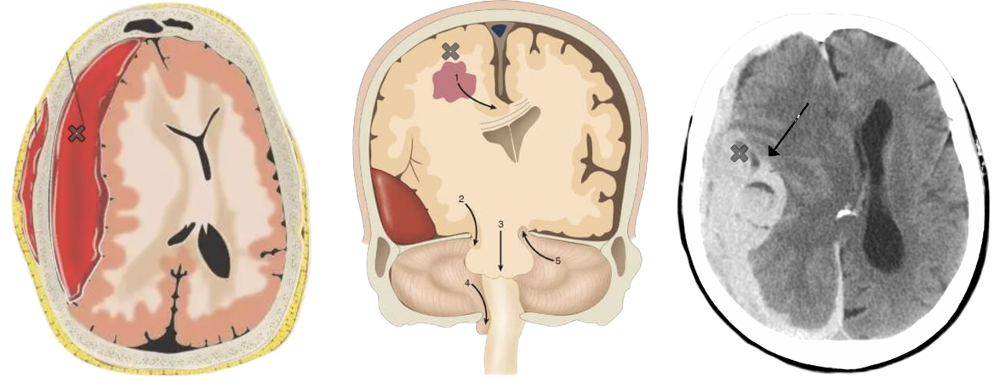
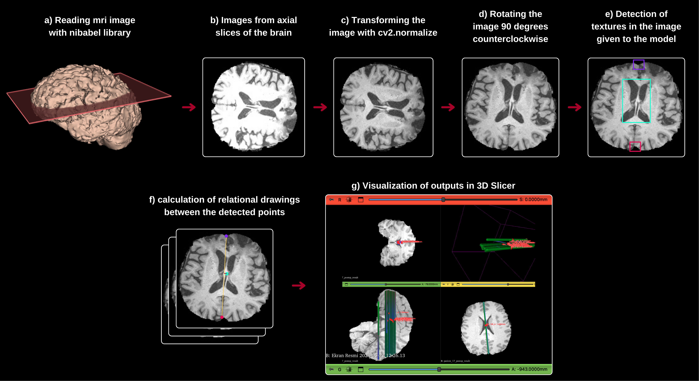
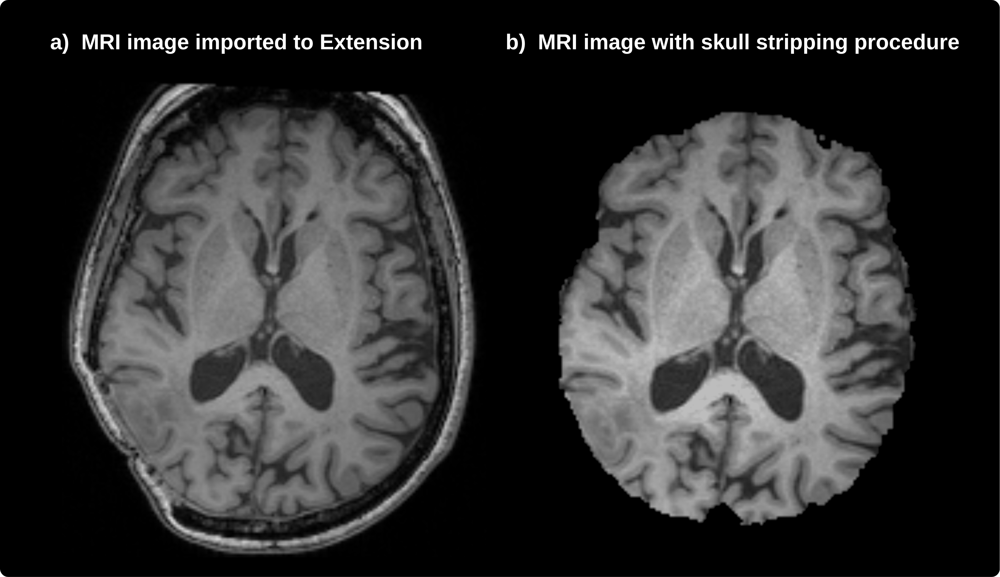
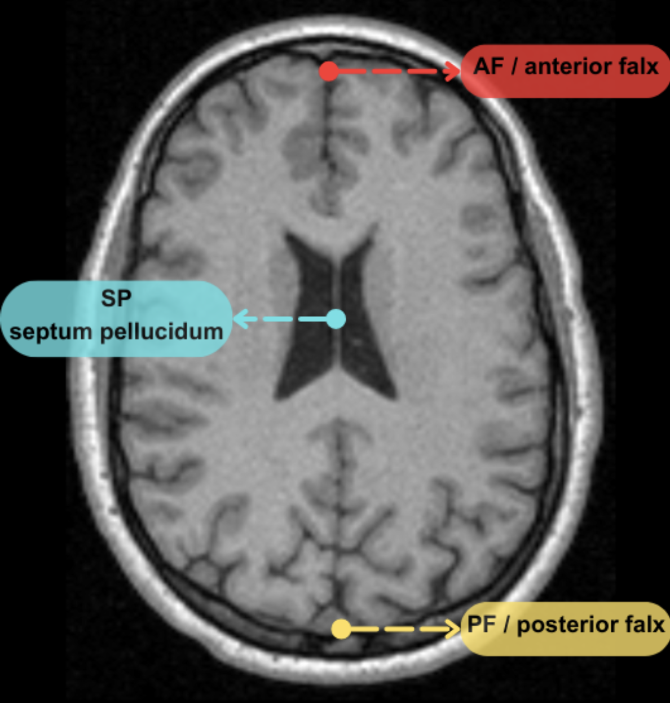
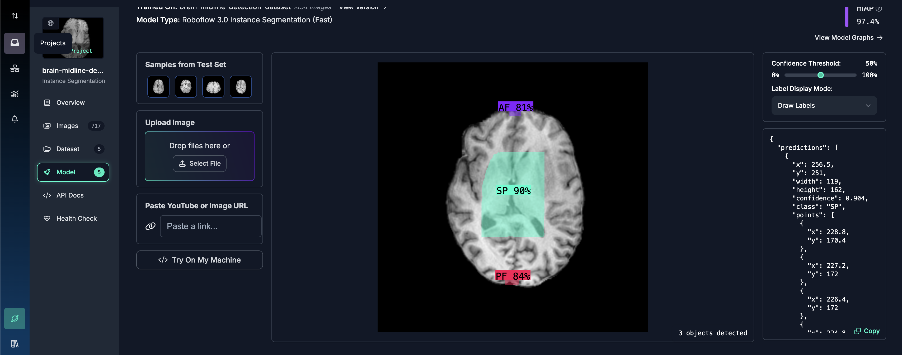
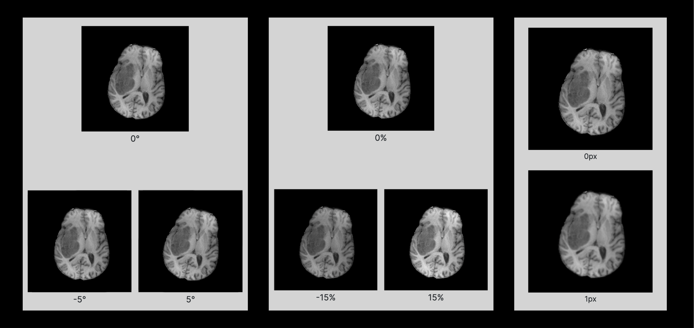
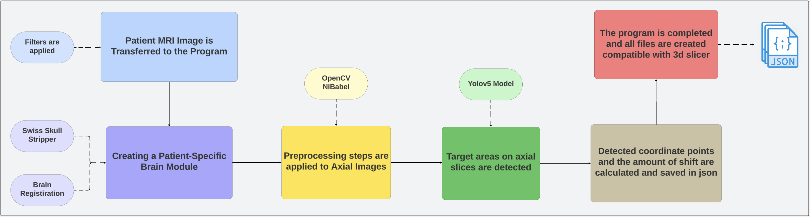

# 3D Slicer Extension for Brain Midline Shift Detection

## Table of Contents

* [Overview](#overview)
* [Dataset Details](#dataset-details)
* [Data Preprocessing Stages](#data-preprocessing-stages)
    - [Separating Tissues Outside the Brain](#separating-tissues-outside-the-brain)
    - [Normalization and Transformation](#normalization-and-transformation)
* [Additional Steps](#additional-steps)
    - [Preparing the Dataset](#preparing-the-dataset)
    - [Data Augmentation](#data-augmentation)
* [3D Slicer Integration](#3d-slicer-integration)
    - [Model Selection and Preparation](#model-selection-and-preparation)
    - [Integration Steps](#integration-steps)
    - [Application Overview](#application-overview)
* [Additional Models and Files](#additional-models-and-files)


## **Overview**

This study aims to calculate brain midline shift. Brain midline shift can occur due to traumatic or natural causes such as hematomas, tumors, and intracranial cysts. Shifts greater than 5 mm often require urgent surgical intervention. This shift is usually measured as the displacement of the septum pellucidum (SP) region between the anterior falx (AF) and posterior falx (PF). Existing models in the literature typically calculate the shift using pre-acquired MRI and CT images. However, in this study, a new module has been developed using brain MRI images and a patient-specific brain model. Deep learning methods have been used to detect the AF, PF, and SP regions.

<p align="center">  </p>

The method focuses on the axial plane of the 3D MRI images, analyzing sections in this plane. The amount of shift is calculated and visualized using mathematical operations. As a result, an MRI file showing the amount of brain midline shift is created by combining the shifts in the 2D plane. This developed module provides rapid and accurate shift detection in clinical decision support systems, with the potential to improve patient outcomes through early diagnosis.

``` 
📌 The module integrates with the 3D Slicer platform to detect and visualize brain midline shifts. This integration enhances the precision and effectiveness of brain surgery planning and evaluation processes.
```

<p align="center">  </p>

---

### **Dataset Details**

🗄️ The Brain Resection Multimodal Imaging Database (ReMIND) provided by The Cancer Imaging Archive has been chosen. This dataset includes preoperative MRI images, intraoperative ultrasound images, intraoperative MRI images, and segmentation series. Here are the dataset details:

```
🔸 369 preoperative MRI images
🔸 320 3D intraoperative ultrasound images
🔸 301 intraoperative MRI images
🔸 356 segmentation series
```

❗️ These data were collected from 123 different patients. However, due to image quality issues, data from 9 patients were excluded, resulting in 114 patient data being used.

For more information, detailed data about the dataset can be found on [The Cancer Imaging Archive](https://www.cancerimagingarchive.net/).

### **Data Preprocessing Stages**

#### **Separating Tissues Outside the Brain**

⚙️ This is performed using a plugin within the 3D Slicer software. Using an atlas mask, non-brain tissues are separated with a level set algorithm, obtaining only the brain image.
MRI images are processed with `Swiss Skull Stripper`, and then non-brain tissues are separated using an atlas mask.

<p align="center">  </p>

#### Normalization and Transformation

Images are read, normalized, and converted to grayscale.

- **Parameters:**
``` 
🔹 Alpha value: 0
🔹 Beta value: 256
🔹 Normalization type: norm-minmax
🔹 Data type: unsigned 8-bit
``` 
Then, they are rotated 90 degrees clockwise and flipped along the vertical axis to align correctly for the model to produce accurate outputs.

---

### Additional Steps

### Preparing the Dataset

The labeled dataset and usable models have been made publicly available on the Roboflow platform under the name [brain-midline-detection-dataset](https://universe.roboflow.com/brain-point-detection/brain-midline-detection-dataset/model/5). This dataset includes 717 axial MRI images labeled with the coordinates of AF, PF, and SP points.

<p align="center">
        
</p>

<p align="center">
    
</p>

### Data Augmentation

To increase the robustness of the model, data augmentation techniques have been applied to the labeled dataset. These techniques include:

```
♦️ Rotation: Images were rotated between -5° and +5°.
♦️ Brightness Adjustment: Brightness levels were changed by ±15%.
♦️ Blurring: Images were blurred up to 1 pixel.
```

<p align="center">  </p>

```
↪️ As a result, the dataset has been expanded to a total of 1,454 images. The augmented dataset is divided into training, validation, and test sets with the following distribution:

➟ Training Set: 1,230 images (85%)
➟ Validation Set: 158 images (10%)
➟ Test Set: 66 images (5%)
```


### **3D Slicer Integration**

<p align="center">  </p>

#### Model Selection and Preparation
- **YOLOv5m**: Selected for integration due to its compatibility and strong performance. This model has been specially trained on datasets to effectively detect AF, PF, and SP points.
- **YOLOv8 and YOLOv9**: These models have also been trained for comparative analysis. Although improvements in results and performance were achieved, YOLOv5m model was preferred due to integration incompatibility.

#### Integration Steps
- **Preprocessing**: MRI images were processed using OpenCV and Nibabel libraries. These images were read, converted to grayscale, and normalized.
- **Transformation**: To ensure correct alignment for detection, images were rotated 90 degrees counterclockwise.
- **Detection and Storage**: Detected points were stored and saved as JSON files compatible with 3D Slicer.
- **Visualization**: Outputs were visualized in 3D Slicer, providing a comprehensive view of the detected points and their spatial relationships.

#### Application Overview
- **Nibabel Library**: Used to read MRI images.
- **OpenCV Library**: Used for image processing, including reading axial section images, converting them to grayscale, and normalizing them.
- **Model Rotation**: Applied to correctly align images for better detection accuracy.
- **Creating JSON Files**: Used to store detected points and save them as JSON files compatible with 3D Slicer for visualization.

---

## Additional Models and Files
🛠️ Additional models can be included to enhance the functionality and versatility of the 3D Slicer extension. These models should be extensively tested and documented to ensure seamless integration and provide comprehensive usage guides. Detailed descriptions, selection criteria, and integration steps for each model should be provided.

By following these guidelines, the 3D Slicer extension has been developed to provide users with practical tools for detecting brain midline shift. Developing comprehensive models and adding MRI image filters specific to the application will ensure the application is user-friendly and widely adopted.
